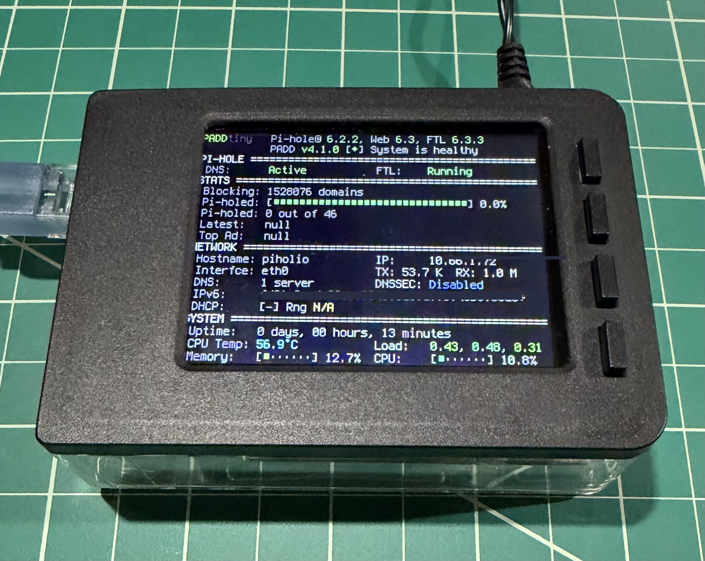

# Pi-hole Display

## Introduction
The Pi-hole Display Controller is a Python application designed to run on a Raspberry Pi with an attached LCD display. It provides a user interface for monitoring Pi-hole statistics and performing system maintenance tasks through physical button controls. The application works in conjunction with the Pi-hole Admin Display Dashboard (PADD, included as a git submodule) to provide both visual feedback and control capabilities.


This is a python module and companion systemd service file,
performing useful functions using the four built-in buttons
on the PiTFT 2.8" Plus 320x240 TFT display panel PCB.

I use this display on a running Pi-Hole to display the Pi-Hole status.
The buttons are used for things like dimming the display, updating, and
restarting or shuting down the Pi for maintenance, etc.



## Use

The code in pitft_buttons.py determines what each button's function is.

The PiTFT 2.8" display has four buttons on GPIO 17, 22, 23, and 27.
In the python code, they are button0, button1, button2, and button3 respectively.
  
#### Button Functions (From top to bottom)

* Button 0, top-most button (GPIO 17):
  - Dim display backlight by 1/8th of full brightness for each press until display reaches "off" state.
    - When in the "off" state, the next button press turns display backlight back to full brightness.
      The PiTFT backlight LEDs are connected to GPIO 18. Brightness is set by PWM to this GPIO. The PWM is gamma-corrected so the 1/8th steps "look good".

* Button 1 (GPIO 22):
  - Run the Pi-Hole system updater
    - Press and hold button for one second when you see the display showing "Updates are available".
      The update function checks to see if an update is needed, and does nothing
      if the PiHole is already up-to-date.
      Release button when the display begins flashing, indicating the the updater is checking and/or running.
      Results are logged in syslog, so use journalctl, and/or check /var/log/messages, for results.

* Button 2 (GPIO 23):
  - Run the Pi-Hole gravity database updater
    - Press and hold button for one second when you have added or changed Ad-lists and need to update Pi-Hole DBs.
      Release the button when the display begins flashing, indicating the gravity updater is running.
      Results are logged in syslog, so use journalctl, and/or check /var/log/messages, for results.

* Button 3 (GPIO 27):
  - Restart or Shutdown
    - To Restart Pi, press and hold for more than 2 seconds, but less than 5 seconds.
    - To Shutdown Pi, press and hold for more than 5 seconds.
    - NOTE: The display will "blink" to indicate what will happen when you release button.
            When you see:
      * one blink, releasing button will restart Pi
      * a second blink, releasing button will shutdown Pi


## Requirements

### Hardware

* A Raspberry Pi (tested on a model 3B and 3B+)

* Display and enclosure---modify/customize enclosure as you prefer, this is what I did:
  - Adafruit PiTFT Plus 320x240 2.8" TFT (assembled with four buttons on the side.)
    - https://www.adafruit.com/product/2423
  - Faceplate and Buttons Pack for 2.8" PiTFTs
    - https://www.adafruit.com/product/2807
  - Pi Model B+ / Pi 2 / Pi 3 - Case Base and Faceplate Pack - Clear - for 2.8" PiTFT
    - https://www.adafruit.com/product/3062


### Software

* Raspberry Pi OS Lite
  - Tested on: "Raspbian GNU/Linux 10 (buster)"
  - https://www.raspberrypi.org/software/operating-systems/

* Python 3

* git

* Adafruit Raspberry Pi Installer scripts
  - https://learn.adafruit.com/adafruit-pitft-28-inch-resistive-touchscreen-display-raspberry-pi

* Pi-Hole (optional, but this is what I'm using it for)

* PADD (Pi-hole Admin Display Dashboard)
  - **Included as a git submodule** - automatically cloned when using `--recurse-submodules`
  - https://github.com/pi-hole/PADD

* Python packages (see requirements.txt):
  - gpiozero (tested on Version 1.5.1 or later)
  - PyYAML
  - pigpio
  - setuptools

## Installation

### Hardware

#### PiTFT Plus 2.8" TFT connected to Pi 40-pin GPIO connector


### Software

#### PiHole
* Install PiHole and get it up and running for your network
  - https://docs.pi-hole.net/main/basic-install/
* If you already have PiHole running, move along...

#### pip3
If you don't have pip3, install it with
```
sudo apt install python3-pip
```

#### Git
If you don't have git, install it with
```
sudo apt install git
```

#### gpiozero
If you don't have gpiozero, install it with
```
sudo apt install python3-gpiozero
```
or
```
sudo pip3 install gpiozero
```
#### Get pihole_display (this repository)
**Important:** Use `--recurse-submodules` to automatically clone the PADD submodule:
```
cd ~
git clone --recurse-submodules https://github.com/andersix/pihole_display.git
```

If you already cloned without submodules, initialize them:
```
cd ~/pihole_display
git submodule update --init --recursive
```

**Note:** PADD is now included as a git submodule and configured by default in `config/config.yaml`. If you prefer to use a different PADD installation location, you can edit the `paths.padd_dir` and `paths.padd_script` settings in the config file.

#### pigpio
If you don't have pigpio, install it with
```
sudo apt install pigpio
```
* enter ```sudo raspi-config``` on the command line, and enable Remote GPIO.
  - select "3 Interface Options", then "P8 Remote GPIO", then "Yes" to enable.
  - select OK then Finish to exit raspi-config
* enable and start the gpio service
  - ```sudo systemctl enable pigpiod```
  - ```sudo systemctl start pigpiod```
  - NOTE: starting and enabling the pigpiod service will not allow remote connections unless configured accordingly, but that's OK since we're only using it locally.

#### Get the Adafruit installer scripts for the PiTFT:
```
cd ~
sudo pip3 install --upgrade adafruit-python-shell click==7.0
sudo apt-get install -y git
git clone https://github.com/adafruit/Raspberry-Pi-Installer-Scripts.git
cd Raspberry-Pi-Installer-Scripts
```

#### Pick the appropriate installer
I'm using the PiTFT 2.8 Capacitive, so am using:
```
sudo python3 adafruit-pitft.py --display=28c --rotation=90 --install-type=console
```
* for other displays, or details, check here:
  - https://learn.adafruit.com/adafruit-pitft-28-inch-resistive-touchscreen-display-raspberry-pi/easy-install-2
  
#### Reboot and return to here
Once the PiTFT script is installed, reboot your Pi, and return to the next step below.

#### Enable Auto-Login (Required)
The display controller requires auto-login to start automatically on boot.

Configure auto-login using raspi-config:
```bash
sudo raspi-config
```
- Select "1 System Options"
- Select "S5 Boot / Auto Login"
- Select "B2 Console Autologin" (Text console, automatically logged in as 'pi' user)
- Select Finish and reboot if prompted

#### Change the console font
* Edit the /boot/cmdline.txt file and to the end of the line, after "rootwait", add:
```
fbcon=map:10 fbcon=font:VGA8x8
```
Save the file, and it should have
```
$ cat /boot/cmdline.txt
console=serial0,115200 console=tty1 root=PARTUUID=XXXXXXXX-XX rootfstype=ext4 elevator=deadline fsck.repair=yes rootwait fbcon=map:10 fbcon=font:VGA8x8
```
(NOTE: don't change the value for the PARTUUID in your cmdline.txt file)

##### Improve console font
Run the command
```
sudo dpkg-reconfigure console-setup
```
and go select the following options to get Terminus 6x12
* Encoding:
  - UTF-8
* Character set to support:
  - Guess optimal character set
* Font for the console:
  - Terminus
* Font size:
  - 6x12 (framebuffer only)

#### Configure Display Controller to Start at Boot

**Important:** This assumes your Raspberry Pi is configured for auto-login on boot.

Edit the pi user's `~/.bashrc` and add the following code **at the very top** of the file:

```bash
# Run PiHole display controller
if [ "$TERM" == "linux" ] ; then
  if [ -f /home/pi/pihole_display/scripts/start_display.sh ]; then
      /home/pi/pihole_display/scripts/start_display.sh
      return 0
  fi
fi
```

This startup script (`scripts/start_display.sh`) automatically:
- Creates a tmux session with two windows
- Starts PADD in the first window to display Pi-hole statistics
- Starts the button controller (`main.py`) in the second window
- Switches to the PADD window for display
- Logs startup details to `log/startup.log`

**Note:** If you want to customize the PADD location, edit `config/config.yaml` and update the `paths.padd_dir` and `paths.padd_script` settings.
## add user to pihole group
The new pihole requires authentication. I opted to add the pihole display user, "pi" in my case, to the pihole group.
See `https://github.com/pi-hole/PADD?tab=readme-ov-file#authentication` for details and other options.
```
# Add the pihole user to the pihole group:
$ whoami
pi
$ sudo usermod -G pihole pi
```

#### Reboot and return to here
After this reboot, the dipslay should show the PADD status screen for your PiHole.

Now let's get the buttons code working:

#### Install Python dependencies
```bash
cd ~/pihole_display
sudo pip3 install -r requirements.txt
```

#### Verify pigpiod is running
The pigpio daemon should already be running from the earlier setup step. Verify it:
```bash
sudo systemctl status pigpiod
```

If not running, start it:
```bash
sudo systemctl enable pigpiod
sudo systemctl start pigpiod
```

#### Reboot to start the display controller
After adding the startup code to `.bashrc`, reboot your Pi:
```bash
sudo reboot
```

The display controller should automatically start on boot, create the tmux session, launch PADD, and activate button control.

That's it! The buttons should be working as described above. If you have issues, see the Troubleshooting section.

## Troubleshooting

### Check if the tmux session is running
```bash
tmux list-sessions
```
You should see a session named "display". If not, the startup script may have failed.

### Check startup logs
```bash
cat ~/pihole_display/log/startup.log
```
This shows detailed information about the tmux session creation and startup process.

### Check application logs
```bash
tail -f ~/pihole_display/log/pihole_display.log
```
This shows runtime logs from the Python application, including button presses and any errors.

### Verify pigpiod is running
```bash
sudo systemctl status pigpiod.service
```
You should see "Active: active (running)". If not:
```bash
sudo systemctl enable pigpiod
sudo systemctl start pigpiod
```

### Check if Python process is running
```bash
pgrep -f "main.py"
```
Should return a process ID. If not, the controller isn't running.

### Attach to the tmux session to see what's happening
```bash
tmux attach -t display
```
- Press `Ctrl+b` then `w` to see and select between windows
- Press `Ctrl+b` then `d` to detach without stopping the session

### Common Issues

**Buttons not responding:**
- Verify Python process is running: `pgrep -f main.py`
- Check that pigpiod is running
- Review application logs for GPIO errors
- Check for syntax errors if you modified the code

**Display not showing PADD:**
- Verify tmux session exists: `tmux ls`
- Check PADD submodule is initialized: `ls ~/pihole_display/PADD/padd.sh`
- Review startup logs: `cat ~/pihole_display/log/startup.log`

**Application won't start on boot:**
- Verify auto-login is enabled: `sudo raspi-config`
- Check .bashrc has startup code at the top
- Verify file paths in the .bashrc code match your installation

## Updates

### Updating the Application

When there are updates to this project:
```bash
cd ~/pihole_display
git pull
git submodule update --remote --merge  # Update PADD submodule

# Restart the application by killing the tmux session
tmux kill-session -t display
# Then manually run the startup script or reboot
/home/pi/pihole_display/scripts/start_display.sh
```

### Update History

* **2025-11-02**
  - PADD is now included as a git submodule
  - Configuration centralized in `config/config.yaml`
  - Modular architecture with separate controllers for display, buttons, PiHole, and system operations
  - Menu system with confirmation timeout for safer operation

* **2022-5-09**
  - Now using the pigpio factory for PWM control to eliminate backlight flicker when dimmed
  - Updated buttons to use press-and-hold (2 second) pattern for menu activation

## Modifications and Improvements

Submit pull requests. Go for it. You can do it.
