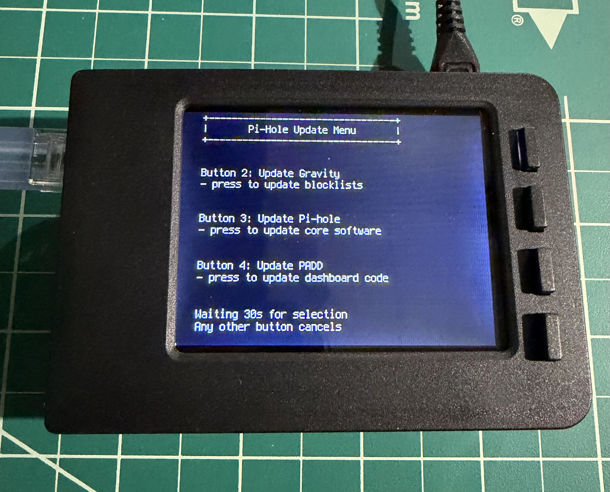
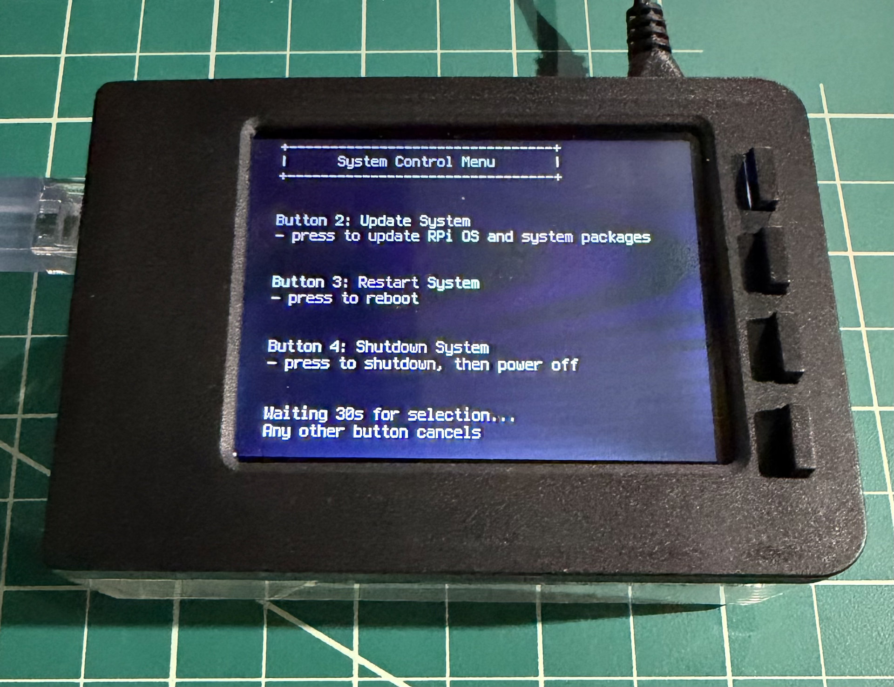

# User Guide

This guide explains how to use the Pi-hole Display Controller buttons to control your Pi-hole and Raspberry Pi.

---

## Display Modes

The PiTFT 2.8" display has four buttons on the side that provide different functions depending on the current mode:

- **Normal mode**: Displays PADD statistics, dimmable with Button 1
- **Pi-Hole Update Menu**: Accessed by holding Button 1 for 2 seconds
- **System Control Menu**: Accessed by holding Button 2 for 2 seconds

---

## Button Layout

```
 ┌─────────────────────────┌─────────────┐
 │ PI-HOLE =============== │  Button 1   │ ← Top button
 │                         ├─────────────┤
 │ STATS ================= │  Button 2   │
 │                         ├─────────────┤
 │ NETWORK =============== │  Button 3   │
 │                         ├─────────────┤
 │ SYSTEM ================ │  Button 4   │ ← Bottom button
 └─────────────────────────└─────────────┘
```

---

## Normal Mode (PADD Display)

When the display shows PADD with Pi-hole statistics:

### Button 1 - Brightness & Menu
- **Press**: Cycle through brightness levels (8 levels from full to off)
- **Hold 2 seconds**: Display the **Pi-Hole Update Menu**

### Button 2 - System Menu
- **Hold 2 seconds**: Display the **System Control Menu**

### Buttons 3 & 4
- Not used in normal mode

---

## Pi-Hole Update Menu

**How to access**: Hold Button 1 for two seconds



The display shows your options:

```
+---------------------------------+
|       Pi-Hole Update Menu       |
+---------------------------------+

Button 2: Update Gravity
Button 3: Update Pi-hole
Button 4: Update PADD

Waiting 30s for selection
Any other button cancels
```

### Button Functions

**Button 1: Cancel**
- Returns to PADD display
- Same as waiting for the 30-second timeout

**Button 2: Update Gravity**
- Updates Pi-hole's blocklists (gravity database)
- Use this after adding new blocklists or to refresh ad-blocking lists
- Shows download progress in real-time
- Typically takes 1-3 minutes depending on number of blocklists
- Returns to PADD display when complete

**Button 3: Update Pi-hole**
- Updates Pi-hole core software to the latest version
- Use when Pi-hole notifies you that an update is available
- Shows update progress in real-time
- Typically takes 2-5 minutes
- May require a system reboot afterward if prompted
- Returns to PADD display when complete

**Button 4: Update PADD**
- Updates the PADD dashboard display from the Pi-hole project GitHub repository
- Shows what files changed during the update
- Typically takes less than 1 minute
- Returns to PADD display when complete

### Notes
- All updates display progress in real-time on the screen
- Error messages are shown if something fails
- The menu times out after 30 seconds of inactivity
- Display automatically switches to full brightness when menu appears

---

## System Control Menu

**How to access**: Hold Button 2 for two seconds



The display shows your options:

```
+--------------------------------+
|      System Control Menu       |
+--------------------------------+

Button 2: Update System
Button 3: Restart System
Button 4: Shutdown System

Waiting 30s for selection...
Any other button cancels
```

### Button Functions

**Button 1: Cancel**
- Returns to PADD display
- Same as waiting for the 30-second timeout

**Button 2: Update System**
- Updates Raspberry Pi OS and all installed packages
- Runs `apt update`, `apt full-upgrade`, and `apt autoremove`
- Shows update progress in real-time
- May take 5-15 minutes depending on available updates
- If no updates available, displays "System is already up to date"
- Returns to PADD display when complete

**Button 3: Restart System**
- Reboots the Raspberry Pi
- Display will go dark briefly
- System restarts and PADD reappears within 1-2 minutes
- Use this after Pi-hole updates if prompted

**Button 4: Shutdown System**
- Safely shuts down the Raspberry Pi
- Display will go dark and stay dark
- Wait for the activity LED to stop blinking before unplugging power
- **Important**: Always use this before unplugging to prevent SD card corruption

### Notes
- The menu times out after 30 seconds of inactivity
- Display automatically switches to full brightness when menu appears
- All operations show their progress on the display

---

## Tips and Best Practices

### Brightness Control
- Press Button 1 repeatedly to cycle through 8 brightness levels
- Brightness setting is saved when switching between PADD and menus
- Lowest setting turns the backlight completely off (display is dark)
- Menus automatically switch to full brightness for visibility

### Update Recommendations
- **Gravity Updates**: Run weekly or after adding new blocklists
- **Pi-hole Updates**: Run when notified of new version in admin interface
- **PADD Updates**: Run monthly or when you want new features
- **System Updates**: Run monthly or as part of regular maintenance

### Safe Shutdown
- Always use Button 4 in the System Control Menu before unplugging power
- Wait for the display to go dark and activity LED to stop blinking
- This prevents SD card corruption and data loss

### Viewing Logs
If you need to troubleshoot or see detailed information:
```bash
# View application logs
tail -f ~/pihole_display/log/pihole_display.log

# View startup logs
cat ~/pihole_display/log/startup.log
```

### Menu Timeouts
- All menus timeout after 30 seconds of inactivity
- This prevents accidentally leaving the system in menu mode
- Simply access the menu again if it times out

---

## Common Questions

**Q: Why does the display go bright when I enter a menu?**
A: Menus automatically switch to full brightness so you can easily see your options. Your previous brightness setting is restored when you return to PADD.

**Q: What happens if I press the wrong button?**
A: Button 1 always cancels and returns to PADD display. You can also just wait 30 seconds for the timeout.

**Q: Can I update everything at once?**
A: No, you must select one update at a time. This allows you to see the progress and results of each operation clearly.

**Q: Do I need to be connected to the internet for updates?**
A: Yes, all updates download from the internet. Ensure your Raspberry Pi has network connectivity.

**Q: Will updates interrupt my Pi-hole DNS service?**
A: Gravity updates do not interrupt service. Pi-hole core updates may briefly interrupt DNS during the update process.

**Q: How do I know if an update was successful?**
A: The display shows "Operation completed successfully" or similar message. Check the logs for detailed information if needed.
